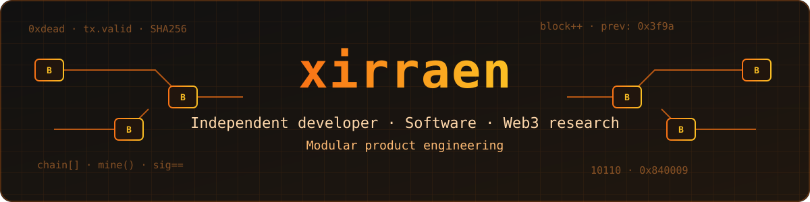

  

  <a href="https://twitter.com/xirraen">X</a> ·
  <a href="https://t.me/xirraen">Telegram</a>

## About

I'm **xirraen**, an independent developer. This repository is my personal development workspace: where I prototype ideas, run research, and shape them into small, well-scoped products.

## Focus areas

- Software experiments and rapid prototyping
- Web3 research
- Modular product engineering

## How I work

1. Evidence over unsupported claims.
2. Safe defaults and no secrets in client code.
3. Small, reviewable changes with automated checks.
4. Explicit product boundaries: a UI is not proof of production capability.
5. Shared infrastructure only when real needs justify it.

## Workspace layout

| Path | Purpose |
| --- | --- |
| `projects/` | Applications and project-specific docs |
| `packages/` | Shared packages, only when reused |
| `docs/` | Architecture, engineering, security, and governance |
| `scripts/` | Repeatable maintenance tasks |
| `.github/workflows/` | Automated quality and security checks |

## Projects

- [Dropchoice](projects/dropchoice/README.md) — evidence-first Web3 opportunity intelligence prototype. It uses demo data and does not connect wallets, sign, or execute transactions.
- [XXX](projects/xxx/README.md) — minimal scaffold reserved for a future product definition.

## Docs

[Architecture](ARCHITECTURE.md) · [Roadmap](ROADMAP.md) · [Changelog](CHANGELOG.md) · [Contributing](CONTRIBUTING.md) · [Governance](GOVERNANCE.md) · [Security](SECURITY.md) · [Support](SUPPORT.md)

## Connect

Find me on [X](https://twitter.com/xirraen) or [Telegram](https://t.me/xirraen).

## Contributing and security

Contributions are welcome; please read [CONTRIBUTING.md](CONTRIBUTING.md) and the [Code of Conduct](CODE_OF_CONDUCT.md). Report vulnerabilities via [SECURITY.md](SECURITY.md), not public issues.

## License

[MIT](LICENSE) © xirraen
